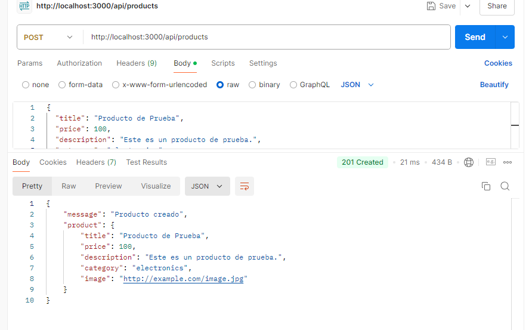
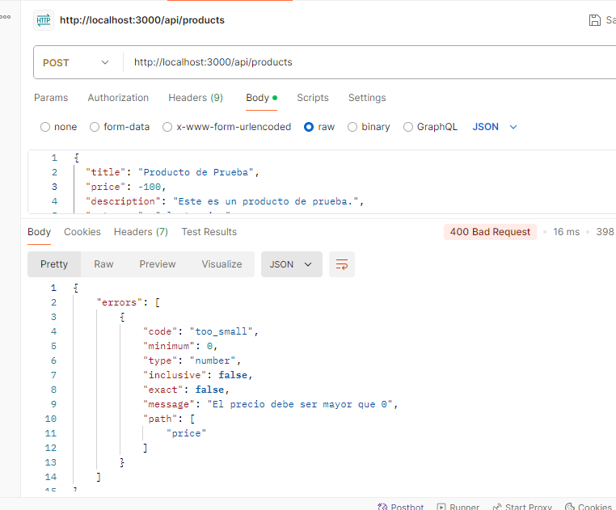

# Make It Real - Validación de Productos con Zod y TypeScript

Esta es una solución para el Sprint 4 Assessment 1: Aplicación Web con TypeScript y Express.js. El código implementa una API para gestionar productos, utilizando Zod para la validación de datos.

## Tabla de Contenidos

- [Resumen](#resumen)
- [El desafío](#el-desafío)
- [Pantallazo](#pantallazo)
- [Mi proceso](#mi-proceso)
- [Tecnología utilizada](#tecnología-utilizada)
- [Lo que aprendí](#lo-que-aprendí)
- [Desarrollo a futuro](#desarrollo-a-futuro)
- [Recursos útiles](#recursos-útiles)
- [Autor](#autor)
- [Agradecimientos](#agradecimientos)

## Resumen

Esta aplicación permite crear productos con características específicas, validando la entrada del usuario antes de procesarla. Utiliza Zod para asegurar que los datos cumplen con los requisitos establecidos.

### El desafío

Mejorar nuestras habilidades en TypeScript y Express.js, enfocándonos en la validación de datos con Zod.

### Pantallazo

Se muestra el pantallazo del funcionamiento de la API.

Si todo está conforme, un mensaje de "producto creado"

Si hay algun error, como el precio en valor negativo, un mensaje "El precio debe ser mayor que 0", codigo: "too_small", en referencia al path "price"

## Mi proceso

1. **Configuración del Proyecto**: Se creó un proyecto en TypeScript y se configuró Express como servidor.
2. **Definición de Rutas**: Se implementaron rutas para gestionar productos, incluyendo la validación de datos.
3. **Middleware de Validación**: Se utilizó Zod para crear un esquema de validación que garantiza la integridad de los datos.

### Tecnología utilizada

- TypeScript
- Express.js
- Zod para validación de esquemas

### Lo que aprendí

Durante el desarrollo de este proyecto, aprendí a implementar un middleware de validación usando Zod y a manejar errores de manera efectiva en una API REST.

### Desarrollo a futuro

En futuros proyectos, planeo explorar más sobre la integración de bases de datos y la gestión de autenticación en aplicaciones web.

### Recursos útiles

- [Documentación de Zod](https://zod.dev/)
- [Documentación de Express.js](https://expressjs.com/)

## Autor

- GitHub - [@TuUsuario](https://github.com/TuUsuario)

## Agradecimientos

Agradezco a los instructores del curso Make It Real por proporcionar un marco tan útil para este proyecto. También quiero reconocer a la comunidad de desarrolladores en línea que ofrece valiosos recursos y apoyo.
